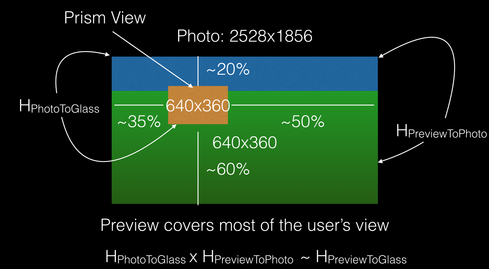

Augmented Reality
=================

While Glass has a relatively small display and won't be able to create full immersive overlays, there are several interesting applications of AR that have been under-explored.  We have put together the building blocks to get you started, this will require understanding how they work to use them properly and this module is highly experimental.

   This shows the relationship between the Prism, Photo, and Preview (640x360) images.

hPhotoToGlass: Slightly different for each Glass and good results require calibation (see the wearscript-ar repo).
hPreviewToPhoto: Each preview image has a different area (not all sizes are supported, see below) however they are constant across devices; however, changes in the underlying Glass camera code have caused changes in the past.

displayWarpView([Array hPhotoToGlass]) : void
  Warps each preview image to the display such that it overlaps with what the user sees (works for objects > 7ft away, currently supported resolutions are 640x360 and 1280x720).  If the hPhotoToGlass homography is not provided a default is used; however, it won't match perfectly, each Glass is slightly different and they only need to be calibrated once.

.. code-block:: guess

    <html style="width:100%; height:100%; overflow:hidden">
    <body style="width:100%; height:100%; overflow:hidden; margin:0">
    </body></html>

warpPreviewSampleGlass([Function callback]) : void
  Publishes the next preview image it gets, AR server uses it to match subsequent images to, a local copy is stored and can be drawn on using WS.warpDraw.

  * Callback has parameters of the form function `callback(Homography array)`

warpSetOverlay(String imageb64) : void
  Sets the overlay being warped that corresponds with the last sample selected.

.. code-block:: guess

    function server() {
	WS.cameraOn(1.2, 360, 640);
	WS.displayWarpView();
	function sample() {
	    setTimeout(function (){
		WS.warpDraw(640 / 2, 360 / 2, 10, 255, 0, 0);
	    }, 1500)
	    WS.warpPreviewSampleGlass('');
	}
	WS.dataLog(false, true, .15);
	WS.gestureCallback('onGesture', function (gesture) {
	    if (gesture === 'TAP') {
		WS.sound('SUCCESS');
		sample();
	    }
	});
    }
